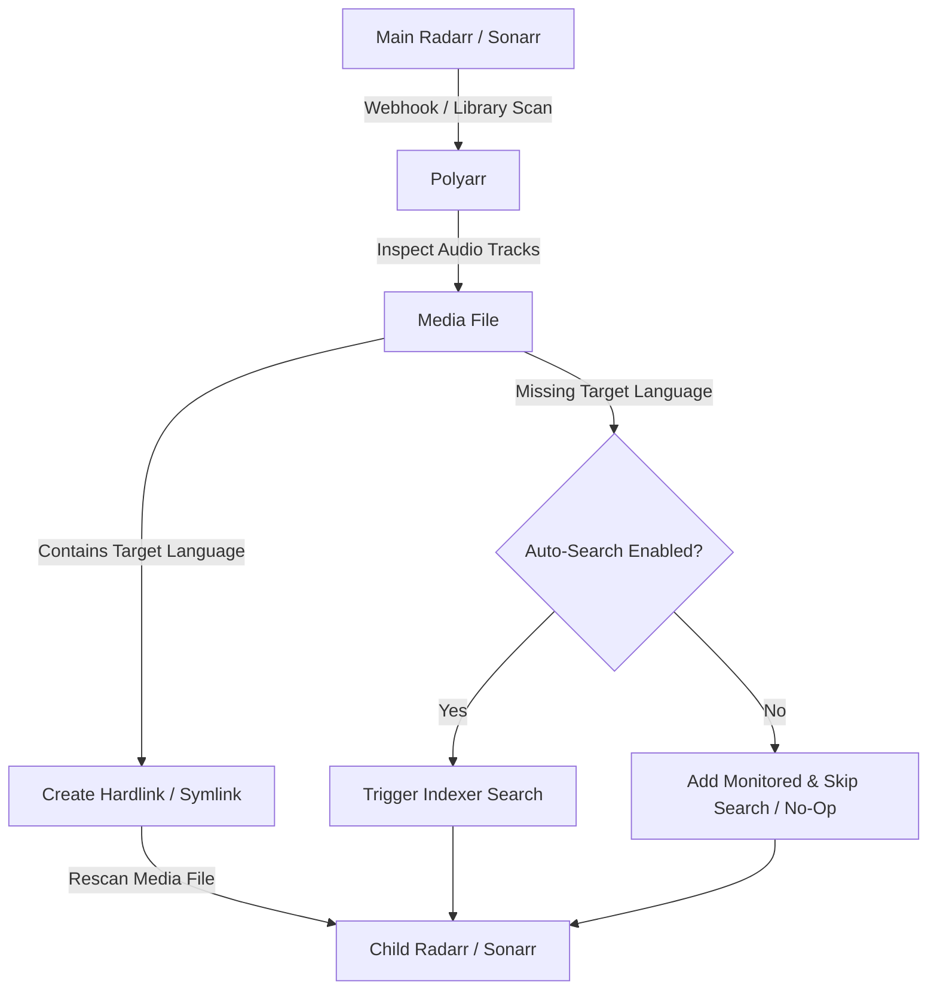

# 🌐 Polyarr

**Multi-language Radarr/Sonarr sync tool — share multi-audio media across language-specific instances**

> [!WARNING]
> ⚠️ **DISCLAIMER: This project is vibe-coded and has not been fully tested. Use at your own risk. While effort has been made to ensure correctness, there may be bugs, edge cases, or unexpected behaviors. Always back up your Radarr/Sonarr configurations and media libraries before using Polyarr.**

## Features
- **Multi-audio detection**: Analyzes media files to detect included audio languages using mediainfo.
- **Hardlink/symlink support**: Shares identical media across instances without duplicating disk space.
- **Webhook-driven sync**: Real-time synchronization triggered by Radarr/Sonarr events.
- **Full library scanner**: Scan existing libraries to align media across instances.
- **Media library browser**: Built-in web UI to browse and manage synced content.
- **Sonarr season monitoring sync**: Keeps monitored status in sync across different Sonarr instances.

## How It Works
Polyarr acts as an intelligent coordinator between your **Main** (primary language) and **Child** (secondary language) Radarr/Sonarr instances:

1. **Import / Scan**: When a movie or episode is imported in the Main instance (via webhook) or discovered during a library scan, Polyarr inspects the file using `mediainfo` to detect all embedded audio tracks.
2. **Target Audio Present (Hardlink)**: If the file contains the Child instance's target audio language, Polyarr instantly creates a zero-space hardlink (or symlink) at the Child's path and commands the Child instance to rescan the media.
3. **Target Audio Missing**:
   - **Auto-Search ON**: Polyarr adds the item as monitored in the Child instance and triggers an automated search on indexers for a version containing the secondary language.
   - **Auto-Search OFF**: Polyarr adds the item to the Child instance as monitored (so the library stays synchronized) but does **NOT** trigger any search commands. Missing audio items are cleanly skipped / no-op, allowing you to search manually or rely on standard RSS feeds.



## Sync Profile Settings

When creating or editing a Sync Profile in the **Settings** or **Sync Profiles** page, you can configure:

- **Link Strategy**: Choose between `Hardlink` (default, uses 0 additional disk space on the same filesystem) or `Symlink`.
- **Delay Before Child Search (Hours)**: How many hours to wait before searching the child instance if the target audio is missing.
- **Enable Active Scanning & Syncing**: Toggle whether this profile participates in automated background syncs, library scans, and incoming webhook imports.
- **Auto-Search Missing Audio**:
  - `ON`: Triggers an automated search on child indexers if the main file lacks the target audio.
  - `OFF`: Missing audio items are ignored (no-op for linking and searching). Only files that already contain the target audio track are hardlinked.
- **Sync Monitored Seasons (Sonarr only)**:
  - Dynamically displayed only when syncing Sonarr instances.
  - Keeps season monitored/unmonitored flags synchronized between your primary and secondary Sonarr instances. Automatically hidden for Radarr profiles as movies do not have seasons.

## Quick Start
```yaml
# docker-compose.yml
services:
  polyarr:
    image: polyarr:latest
    container_name: polyarr
    ports:
      - "3000:3000"
    volumes:
      - ./data:/app/data
      - /path/to/media:/media  # Mount your media library - adjust path
    environment:
      - PORT=3000
      - LOG_LEVEL=info
      - DATA_DIR=/app/data
    restart: unless-stopped
```
1. Copy the `docker-compose.yml` above or use the repository version.
2. Adjust the volume mounts to match your media libraries.
3. Run `docker-compose up -d`.
4. Access the web interface at `http://localhost:3000`.

## Configuration
1. **Add instances**: Go to Settings -> Add your Main and Child instances (URL, API key, target language).
2. **Create sync profiles**: Map a Main instance to a Child instance, and define the path mappings.
3. **Configure webhooks**: In your Radarr/Sonarr instances, set up a webhook pointing to Polyarr's webhook endpoint.

## Volume Mounting
**IMPORTANT**: For hardlinks to work properly, Polyarr must have access to the exact same filesystem and paths as your Radarr/Sonarr instances. Ensure your volume mounts in `docker-compose.yml` exactly match the paths Radarr/Sonarr use.

## Development
Polyarr includes full Dev Container support for VS Code.
To run locally:
- `npm run dev` (runs both backend and frontend concurrently)
- `npm run dev:backend` (runs backend only)
- `npm run dev:frontend` (runs frontend only)
- `npm test`

## Tech Stack
- **Frontend**: Angular 19
- **Backend**: Node.js, Express, TypeScript
- **Database**: SQLite with TypeORM
- **Tools**: mediainfo

## License
MIT
