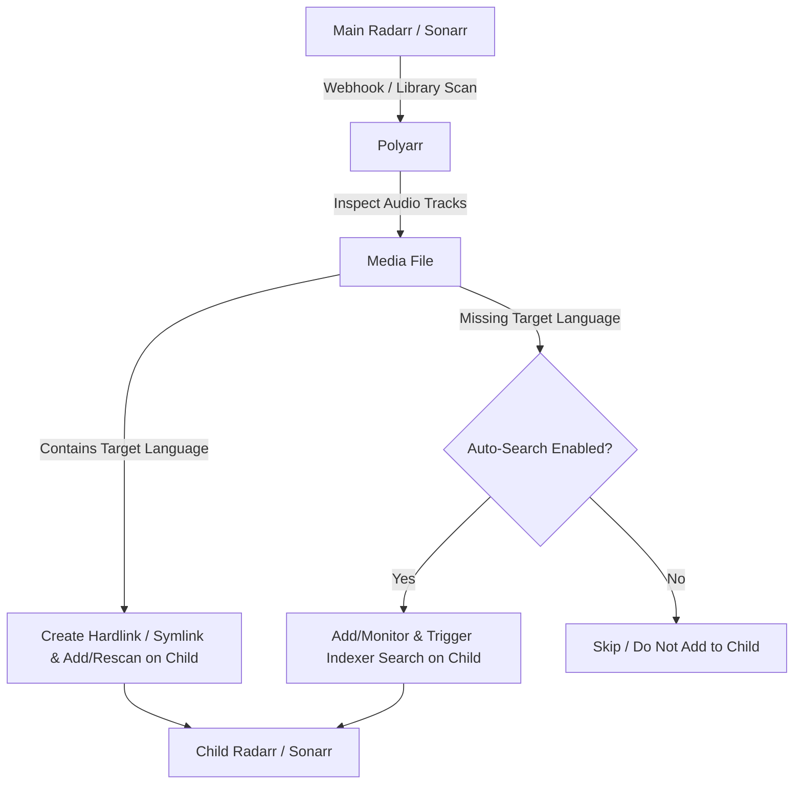

# 🌐 Polyarr

**Multi-language Radarr/Sonarr sync tool — share multi-audio media across language-specific instances**

> [!WARNING]
> ⚠️ **DISCLAIMER: This project is vibe-coded and has not been fully tested. Use at your own risk. While effort has been made to ensure correctness, there may be bugs, edge cases, or unexpected behaviors. Always back up your Radarr/Sonarr configurations and media libraries before using Polyarr.**

---

## ✨ Features

- **Multi-Audio Track Detection**: Inspects media files using MediaInfo to identify all embedded audio languages.
- **Zero-Space Hardlinks & Symlinks**: Shares identical media across instances without duplicating storage space.
- **Webhook-Driven Real-Time Sync**: Automatically links or searches new downloads when Radarr/Sonarr fires import webhooks.
- **Interactive Dry Run Simulation**: Preview synchronization actions safely before executing — view granular reports on what will link, what needs downloading, and what is already linked.
- **Full Library Scanner & Scheduler**: Runs automated background scans to discover and synchronize existing media collections.
- **Media Library & History Browser**: Built-in modern web UI to view matched items, file paths, audio streams, and historical sync audit logs.
- **Sonarr Season Monitor Synchronization**: Keeps season monitored/unmonitored statuses aligned between primary and secondary Sonarr instances.

---

## ⚙️ How It Works

Polyarr acts as an intelligent coordinator between your **Main** (primary language) and **Child** (secondary language) Radarr/Sonarr instances:



1. **Import / Scan**: When a movie or episode is imported in the Main instance (via webhook) or discovered during a library scan, Polyarr inspects the file using MediaInfo to detect all embedded audio tracks.
2. **Target Audio Present (Hardlink)**: If the file contains the Child instance's target audio language, Polyarr ensures the media exists on the Child instance, instantly creates a zero-space hardlink (or symlink) at the Child's path, and commands the Child instance to rescan the media.
3. **Target Audio Missing**:
   - **Auto-Search ON**: Polyarr treats searching and monitoring on the child as the same concept — it adds/monitors the item on the Child instance and triggers an automated search on indexers for a release containing the secondary language.
   - **Auto-Search OFF**: Polyarr completely skips missing-language media. It will **never** add, monitor, or touch the item on the Child instance (hardlinking existing multi-audio files only).

---

## 🔍 Dry Run Simulation

Polyarr features a built-in **Dry Run Simulation** that allows you to safely inspect how Polyarr will process your entire library before any files are linked or any searches are dispatched.

Click the **Dry Run** button (🔍) next to any profile in **Settings** or **Sync Profiles** to generate an instant breakdown:

- **🟢 Would Link (0 Space)**: Media items where the main file already contains the target language audio. Polyarr will create a zero-space hardlink/symlink and rescan the secondary instance.
- **🔵 Already Linked**: Verified hardlinks that are already intact on disk.
- **🟣 Secondary Has Own Copy**: Items where the secondary instance already downloaded its own separate release.
- **🟡 Needs Download**: Media items where the main file lacks the target language audio:
  - If **Auto-Search** is `ON`: Polyarr will add/monitor the item and trigger an indexer search on the secondary instance.
  - If **Auto-Search** is `OFF`: Polyarr will completely skip the item (no-op; child instance is untouched).
- **🔴 Errors**: Reports only legitimate API timeouts, lookup failures, or filesystem permission errors (missing audio files are never treated as errors).

---

## 🎛️ Sync Profile Settings

When creating or editing a Sync Profile in the **Settings** or **Sync Profiles** page, you can configure:

- **Link Strategy**:
  - `Hardlink` (Default): Uses 0 additional disk space by creating a hardlink on the same filesystem.
  - `Symlink`: Creates a symbolic link pointing to the main file.
- **Delay Before Child Search (Hours)**:
  - How many hours to wait before commanding the child instance to search indexers for a separate release.
  - **Why this delay exists**: Gives your primary instance sufficient time to grab, download, and import its release first (which may already include the target audio track).
  - **Immediate hardlinking**: If the primary release already contains the target audio track, Polyarr hardlinks it **immediately with zero delay**. The wait delay only applies before initiating a fallback search on the secondary instance when the target audio is missing.
- **Enable Active Scanning & Syncing**: Toggle whether this profile participates in automated background syncs, library scans, and incoming webhook imports.
- **Auto-Search Missing Audio**:
  - `ON`: Adds/monitors missing-language media on child instance and triggers indexer searches for the target audio.
  - `OFF`: Polyarr never adds or monitors missing-language media on the child instance. Polyarr strictly creates hardlinks for media that already contains the target language audio.
- **Sync Monitored Seasons (Sonarr Only)**:
  - Dynamically displayed only when syncing Sonarr instances (hidden for Radarr as movies do not have seasons).
  - Keeps season monitored/unmonitored flags synchronized between your primary and secondary Sonarr instances.

---

## 🚀 Installation & Deployment

### Option A: Docker (GitHub Container Registry)

Polyarr is published automatically to GitHub Container Registry:

```bash
docker run -d \
  --name polyarr \
  -p 3000:3000 \
  -v /mnt/user/appdata/polyarr:/app/data \
  -v /mnt/user/data:/data \
  -e PORT=3000 \
  -e DATA_DIR=/app/data \
  --restart unless-stopped \
  ghcr.io/controltowarr/polyarr:latest
```

### Option B: Docker Compose

```yaml
# docker-compose.yml
services:
  polyarr:
    image: ghcr.io/controltowarr/polyarr:latest
    container_name: polyarr
    ports:
      - "3000:3000"
    volumes:
      - ./data:/app/data
      - /mnt/user/data:/data  # Mount your media share (crucial for hardlinks)
    environment:
      - PORT=3000
      - LOG_LEVEL=info
      - DATA_DIR=/app/data
    restart: unless-stopped
```

### Option C: Unraid Setup

1. In Unraid, go to the **Docker** tab and click **"Add Container"** at the bottom.
2. Fill out the container settings:
   - **Name**: `polyarr`
   - **Repository**: `ghcr.io/controltowarr/polyarr:latest`
   - **WebUI**: `http://[IP]:[PORT:3000]/`
3. Add the following **Port** and **Path** mappings:
   - **Port**: Host `3000` ➔ Container `3000` (TCP)
   - **Path (Appdata)**: Host `/mnt/user/appdata/polyarr` ➔ Container `/app/data`
   - **Path (Media Mount)**: Host `/mnt/user/data` ➔ Container `/data` (or your shared media pool path)
4. Click **Apply**.

> [!IMPORTANT]
> **Hardlinking on Unraid**:
> For zero-space hardlinks to work, your source and destination libraries must share the same physical pool/share and be accessible within Polyarr under the same volume mount (e.g. `/data` or `/mnt/user/data`).

---

## 🔧 Configuration Guide

### 1. Connect Instances
Go to **Settings** (`/settings`) and add your instances:
- **Main Instance**: Your primary Radarr/Sonarr instance (e.g., English).
- **Child Instance(s)**: Your secondary language instances (e.g., French, Spanish, German). Provide URL, API key, root folder path, quality profile, and target language code (`fr`, `de`, etc.).

### 2. Create Sync Profiles
Map each Main instance to a corresponding Child instance, define path translations (if paths differ across containers), and select your linking preferences.

### 3. Configure Webhooks
To enable instant syncing on download, add a webhook in your Main Radarr/Sonarr instances:
- **Radarr**: Go to `Settings` -> `Connect` -> `+ Webhook`
  - **URL**: `http://<polyarr-ip>:3000/api/webhooks/radarr/<MAIN_INSTANCE_ID>`
  - **Notification Triggers**: `On Download` / `On Upgrade`
- **Sonarr**: Go to `Settings` -> `Connect` -> `+ Webhook`
  - **URL**: `http://<polyarr-ip>:3000/api/webhooks/sonarr/<MAIN_INSTANCE_ID>`
  - **Notification Triggers**: `On Download` / `On Upgrade`

---

## 💾 Volume Mounting & Hardlink Rules

> [!IMPORTANT]
> For **zero-space hardlinks** to work, Polyarr, Radarr, and Sonarr must all have access to the exact same underlying filesystem volume mount. If media files reside on separate volumes or docker mounts across different mount points, hardlinks will fail across filesystem boundaries.

---

## 🛠️ Environment Variables

| Variable | Description | Default |
| :--- | :--- | :--- |
| `PORT` | HTTP port the server listens on | `3000` |
| `DATA_DIR` | Directory where the SQLite database is stored | `/app/data` |
| `LOG_LEVEL` | Logging verbosity (`debug`, `info`, `warn`, `error`) | `info` |
| `NODE_ENV` | Environment mode (`production`, `development`) | `production` |

---

## 💻 Local Development

Polyarr includes full Dev Container support for VS Code / Docker.

### Port Reference
- **Production (Docker)**: `http://localhost:3000` (Express serves backend API + compiled Angular SPA)
- **Development Frontend (Angular CLI Dev Server)**: `http://localhost:4200`
- **Development Backend API (ts-node-dev)**: `http://localhost:3000`

### Commands
```bash
# Run both backend and frontend concurrently
npm run dev

# Run backend only (port 3000)
npm run dev:backend

# Run frontend only (port 4200)
npm run dev:frontend

# Run backend test suite
npm test

# Build both frontend and backend for production
npm run build
```

---

## 📦 Tech Stack

- **Frontend**: Angular, Angular Material / CDK, RxJS
- **Backend**: Node.js, Express, TypeScript, TypeORM, SQLite
- **Tools**: MediaInfo

---

## 📄 License

MIT
