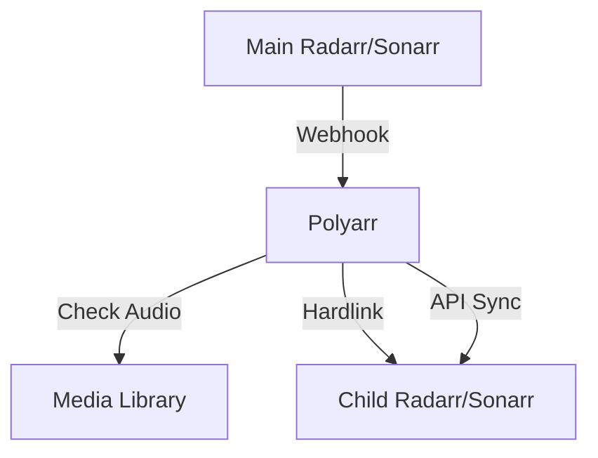

# 🌐 Polyarr

**Multi-language Radarr/Sonarr sync tool — share multi-audio media across language-specific instances**

> [!WARNING]
> ⚠️ **DISCLAIMER: This project is vibe-coded and has not been fully tested. Use at your own risk. While effort has been made to ensure correctness, there may be bugs, edge cases, or unexpected behaviors. Always back up your Radarr/Sonarr configurations and media libraries before using Polyarr.**

## Features
- **Multi-audio detection**: Analyzes media files to detect included audio languages using mediainfo.
- **Hardlink/symlink support**: Shares identical media across instances without duplicating disk space.
- **Webhook-driven sync**: Real-time synchronization triggered by Radarr/Sonarr events.
- **Full library scanner**: Scan existing libraries to align media across instances.
- **Media library browser**: Built-in web UI to browse and manage synced content.
- **Sonarr season monitoring sync**: Keeps monitored status in sync across different Sonarr instances.

## How It Works
Polyarr acts as a middleman between your "Main" and "Child" instances.
1. A movie or episode is downloaded in the Main instance.
2. Polyarr receives a webhook.
3. Polyarr checks the media file for multi-audio tracks.
4. If the target language (Child instance) is present, it hardlinks or symlinks the file.
5. If missing, it can optionally search for the correct language version.



## Quick Start
```yaml
# docker-compose.yml
services:
  polyarr:
    image: polyarr:latest
    container_name: polyarr
    ports:
      - "3000:3000"
    volumes:
      - ./data:/app/data
      - /path/to/media:/media  # Mount your media library - adjust path
    environment:
      - PORT=3000
      - LOG_LEVEL=info
      - DATA_DIR=/app/data
    restart: unless-stopped
```
1. Copy the `docker-compose.yml` above or use the repository version.
2. Adjust the volume mounts to match your media libraries.
3. Run `docker-compose up -d`.
4. Access the web interface at `http://localhost:3000`.

## Configuration
1. **Add instances**: Go to Settings -> Add your Main and Child instances (URL, API key, target language).
2. **Create sync profiles**: Map a Main instance to a Child instance, and define the path mappings.
3. **Configure webhooks**: In your Radarr/Sonarr instances, set up a webhook pointing to Polyarr's webhook endpoint.

## Volume Mounting
**IMPORTANT**: For hardlinks to work properly, Polyarr must have access to the exact same filesystem and paths as your Radarr/Sonarr instances. Ensure your volume mounts in `docker-compose.yml` exactly match the paths Radarr/Sonarr use.

## Development
Polyarr includes full Dev Container support for VS Code.
To run locally:
- `npm run dev` (runs both backend and frontend concurrently)
- `npm run dev:backend` (runs backend only)
- `npm run dev:frontend` (runs frontend only)
- `npm test`

## Tech Stack
- **Frontend**: Angular 19
- **Backend**: Node.js, Express, TypeScript
- **Database**: SQLite with TypeORM
- **Tools**: mediainfo

## License
MIT
